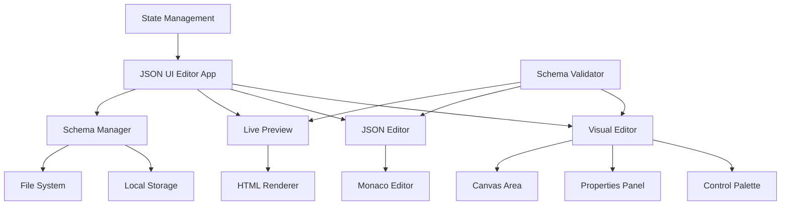

# Design Document

## Overview

The JSON UI Editor is a React/TypeScript application that provides a comprehensive solution for creating, editing, and managing JSON-based UI schemas. The system consists of three main components: a JSON schema specification, a visual editor interface, and an HTML renderer. The architecture follows modern React patterns with TypeScript for type safety, using a component-based approach with clear separation of concerns.

## Architecture

### High-Level Architecture



### Technology Stack

- **Frontend Framework**: React 18+ with TypeScript
- **State Management**: React Context API with useReducer for complex state
- **Code Editor**: Monaco Editor for JSON editing with syntax highlighting
- **Drag & Drop**: react-beautiful-dnd for control reordering
- **Validation**: Zod for runtime schema validation
- **Styling**: CSS Modules or Styled Components for component styling
- **Build Tool**: Vite for fast development and building

## Components and Interfaces

### Core Types and Interfaces

```typescript
// Schema Types
interface UISchema {
  title?: string;
  description?: string;
  layout: 'vertical' | 'horizontal' | 'grid';
  controls: UIControl[];
}

interface UIControl {
  id: string;
  type: ControlType;
  label: string;
  name: string;
  placeholder?: string;
  required?: boolean;
  validation?: ValidationRules;
  options?: SelectOption[];
  className?: string;
}

type ControlType = 'text' | 'email' | 'password' | 'select' | 'checkbox' | 'button' | 'textarea' | 'number';

interface ValidationRules {
  minLength?: number;
  maxLength?: number;
  pattern?: string;
  min?: number;
  max?: number;
  customMessage?: string;
}

interface SelectOption {
  label: string;
  value: string;
}

// Editor State
interface EditorState {
  schema: UISchema;
  selectedControlId: string | null;
  mode: 'visual' | 'json';
  errors: ValidationError[];
  isDirty: boolean;
}
```

### Component Architecture

#### 1. Main Application Component
```typescript
interface JsonUIEditorProps {
  initialSchema?: UISchema;
  onSave?: (schema: UISchema) => void;
  onExport?: (schema: UISchema) => void;
}

const JsonUIEditor: React.FC<JsonUIEditorProps>
```

#### 2. Visual Editor Components
```typescript
// Main visual editor container
const VisualEditor: React.FC<{
  schema: UISchema;
  selectedControlId: string | null;
  onSchemaChange: (schema: UISchema) => void;
  onControlSelect: (controlId: string) => void;
}>

// Control palette for adding new controls
const ControlPalette: React.FC<{
  onAddControl: (type: ControlType) => void;
}>

// Properties panel for editing selected control
const PropertiesPanel: React.FC<{
  control: UIControl | null;
  onControlUpdate: (control: UIControl) => void;
}>

// Canvas area showing the form structure
const FormCanvas: React.FC<{
  controls: UIControl[];
  selectedControlId: string | null;
  onControlSelect: (controlId: string) => void;
  onControlsReorder: (controls: UIControl[]) => void;
}>
```

#### 3. JSON Editor Component
```typescript
const JsonEditor: React.FC<{
  schema: UISchema;
  onSchemaChange: (schema: UISchema) => void;
  errors: ValidationError[];
}>
```

#### 4. Live Preview Component
```typescript
const LivePreview: React.FC<{
  schema: UISchema;
  className?: string;
}>
```

#### 5. HTML Renderer
```typescript
const HTMLRenderer: React.FC<{
  schema: UISchema;
  onSubmit?: (data: Record<string, any>) => void;
  className?: string;
}>
```

## Data Models

### Schema Storage Format
```json
{
  "version": "1.0",
  "metadata": {
    "created": "2024-01-01T00:00:00Z",
    "modified": "2024-01-01T00:00:00Z",
    "author": "user@example.com"
  },
  "schema": {
    "title": "Contact Form",
    "description": "A simple contact form",
    "layout": "vertical",
    "controls": [
      {
        "id": "ctrl_1",
        "type": "text",
        "label": "Full Name",
        "name": "fullName",
        "required": true,
        "validation": {
          "minLength": 2,
          "maxLength": 50
        }
      }
    ]
  }
}
```

### State Management Structure
```typescript
interface AppState {
  editor: EditorState;
  ui: {
    sidebarOpen: boolean;
    activeTab: 'visual' | 'json' | 'preview';
    theme: 'light' | 'dark';
  };
  schemas: {
    saved: SavedSchema[];
    current: UISchema;
    history: UISchema[];
    historyIndex: number;
  };
}
```

## Error Handling

### Validation Strategy
1. **Real-time Validation**: Validate schema changes as they occur
2. **Schema Validation**: Use Zod schemas for runtime type checking
3. **User-Friendly Errors**: Convert technical errors to actionable messages
4. **Error Recovery**: Provide suggestions for fixing common issues

### Error Types
```typescript
interface ValidationError {
  type: 'schema' | 'control' | 'validation';
  controlId?: string;
  field?: string;
  message: string;
  severity: 'error' | 'warning' | 'info';
}
```

### Error Handling Components
```typescript
const ErrorBoundary: React.FC<{ children: React.ReactNode }>
const ValidationErrorList: React.FC<{ errors: ValidationError[] }>
const InlineError: React.FC<{ error: ValidationError }>
```

## Testing Strategy

### Unit Testing
- **Component Testing**: Test individual components with React Testing Library
- **Hook Testing**: Test custom hooks with @testing-library/react-hooks
- **Utility Testing**: Test validation, rendering, and transformation utilities
- **Type Testing**: Ensure TypeScript types are correctly defined

### Integration Testing
- **Editor Workflow**: Test complete editing workflows from creation to export
- **Schema Validation**: Test schema validation across different scenarios
- **Renderer Testing**: Test HTML output generation and form behavior

### E2E Testing
- **User Journeys**: Test complete user workflows with Playwright or Cypress
- **Cross-browser Testing**: Ensure compatibility across modern browsers
- **Accessibility Testing**: Verify WCAG compliance and screen reader support

### Test Structure
```
src/
├── components/
│   ├── __tests__/
│   │   ├── JsonUIEditor.test.tsx
│   │   ├── VisualEditor.test.tsx
│   │   └── HTMLRenderer.test.tsx
├── hooks/
│   └── __tests__/
│       ├── useSchemaValidation.test.ts
│       └── useEditorState.test.ts
├── utils/
│   └── __tests__/
│       ├── schemaValidator.test.ts
│       └── htmlRenderer.test.ts
└── __tests__/
    ├── integration/
    │   └── editor-workflow.test.tsx
    └── e2e/
        └── complete-user-journey.spec.ts
```

## Performance Considerations

### Optimization Strategies
1. **Memoization**: Use React.memo and useMemo for expensive computations
2. **Lazy Loading**: Code-split large components and load on demand
3. **Debouncing**: Debounce real-time validation and preview updates
4. **Virtual Scrolling**: For large forms with many controls
5. **Schema Caching**: Cache validated schemas to avoid re-validation

### Bundle Optimization
- Tree-shaking for unused code elimination
- Dynamic imports for code splitting
- Minimize external dependencies
- Optimize Monaco Editor bundle size

## Security Considerations

### Input Validation
- Sanitize all user inputs before processing
- Validate JSON schemas against defined types
- Prevent XSS through proper HTML escaping
- Limit schema complexity to prevent DoS attacks

### Data Protection
- Store sensitive data securely in local storage
- Implement proper error handling to avoid information leakage
- Validate file uploads for schema import functionality

## Accessibility

### WCAG Compliance
- Proper ARIA labels and roles for all interactive elements
- Keyboard navigation support for all functionality
- Screen reader compatibility
- High contrast mode support
- Focus management for dynamic content

### Implementation Details
- Use semantic HTML elements
- Provide alternative text for visual elements
- Ensure proper heading hierarchy
- Implement skip links for navigation
- Test with actual screen readers